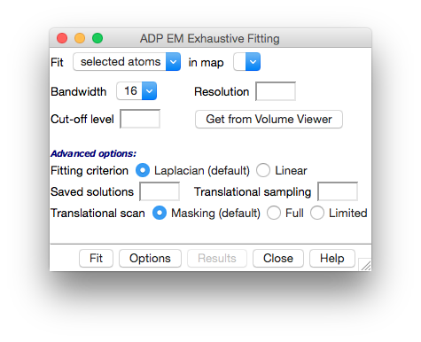
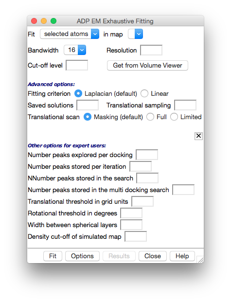

This is a tutorial for using ADP EM molecular fitting tool in Chimera.  As a user, you will be able to load the plugin and fit your PDB's into density maps with fuzzy resolution. Just follow the instructions and enjoy :) 
<h2>Loading the plugin</h2>

To load the plugin in Chimera:

<ul>
<li>If you don't already have a directory on your computer that is specific for external plugins for Chimera, create one called '<strong>Plugins</strong>' wherever you want.

 

</li>
<li>

If you haven't downloaded the plugin, do it 

</li>
</ul>
<ul>
<li>

Uncompress the file in the '<strong>Plugins</strong>' directory.

</li>
</ul>
<ul>
<li>In Chimera, go to <em>Favorites</em> → <em>Preferences</em>, from <em>Category </em>select <em>Tools</em> and add the '<strong>Plugins</strong>' directory containing the <em>ADP EM</em> folder to the Locations.</li>
</ul>

The <em>ADP EM</em> module will be under the <em>Tools</em> → <em>EM Fitting</em> menu.

<h2>Using the plugin</h2>

When loaded, you will see this new window:

In the first row, you could choose you atomic structures and your maps loaded in Chimera. 

There are three required parameters to run the <em>ADP EM</em> fitting process:

<ul>
<li><strong>Bandwidth</strong>: corresponds to the bandwidth in the harmonic transformation. Its values are set to 16, 24, 32, 48 or 64. </li>
</ul>
<ul>
<li><strong>Resolution</strong>: depending on the type of element to fit:</li>
</ul>
<ul>
<ol>- if a Pdb file is fitted → nominal resolution of the projection map in Å.</ol>
</ul>
<ul>
<ol>- If a 3d map is fitted → density threshold value for the fitted map.</ol>
</ul>
<ul>
<li><strong>Cut-off</strong>: is the density threshold value for the experimental map. All density levels below this value will be not considered. You can get this value from the level parameter shown in the Volume Viewer to adjust with more precision your map density.</li>
</ul>

 

These parameters are the minimum required to perform the fitting. The next ones are advanced features that should be used carefully by the user:

<ul>
<li><strong>Fitting criterion</strong>: this option sets the fitting criterion used:</li>
</ul>
<ul>
<ol>- Standard linear cross-correlation → the scalar product between the density maps of the low resolution map and the low-pass filtered atomic structure. Recommended for resolutions &lt; 15Å and when the atomic model accounts all the density of the map.</ol>
</ul>
<ul>
<ol>- Laplacian filter → is applied by default (as told in 2.2) to maximize the fitting contrast. Recommended for resolutions &gt; 15Å and when the atomic model only accounts part of the density of the experimental map.</ol>
</ul>
<ul>
<li><strong>Saved solutions</strong>: number of the saved solutions that <em>ADP EM </em>will compute (50 by default).</li>
</ul>
<ul>
<li><strong>Translational sampling</strong>: in Å, by default twice of voxel size of the density map. Values &gt; 6Å should not be used.</li>
</ul>
<ul>
<li><strong>Translational scan</strong>: translational scan strategy:</li>
</ul>
<ul>
<ol>- Full search → all the translational points inside the target EM map will be explored.</ol>
</ul>
<ul>
<ol>- Limited →  radial search starting from the center of mass.</ol>
</ul>
<ul>
<ol>- Masking search →  default (as told in 2.2).</ol>
</ul>

 

In addition to these parameters, some extra features have been provided to expert users who know how to use the ADP EM tool and what objectives they are looking for. These parameters can be found in the Options button, which displays a new panel to insert them:

<ul>
<li><strong>Number peaks explored per docking</strong>: default 30.</li>
</ul>
<ul>
<li><strong>Number peaks stored per iteration</strong>: default 20.</li>
</ul>
<ul>
<li><strong>Number peaks stored in the search</strong>: default 100.</li>
</ul>
<ul>
<li><strong>Number peaks stored in the multi-docking search</strong>: default 500.</li>
</ul>
<ul>
<li><strong>Translational threshold in grid units</strong>: default 2.0.</li>
</ul>
<ul>
<li><strong>Rotational threshold in degrees</strong>: default 360/bandwidth.</li>
</ul>
<ul>
<li><strong>Width between spherical layers</strong>: default 1.0.</li>
</ul>
<ul>
<li><strong>Density cut-off of the simulated map</strong>: default 0.0</li>
</ul>

Once you have inserted the parameters you want for the adjustment, simply click <em>Fit</em> and enjoy. You will see the process log in a new window and, when it is finished, you can check the results in the corresponding panel.

<h2>Credits</h2>

The plugin was developed by Pablo Solar for Pablo Chacón's group (<a href="http://chaconlab.org/">chaconlab</a>). Acknowledgements to Tom Goddard, UCSF, for providing useful insights.

