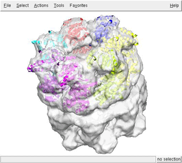
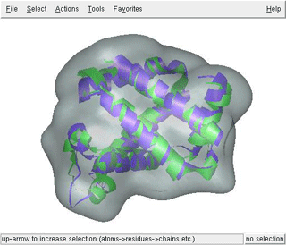

The ADP_EM Tutorials are practical guides for researchers who want to use ADP_EM to perform multiresolution docking. They include working examples and simple instructions. Before you go through the tutorial, first get the corresponding files from download zone. The following tutorials are currently available:

<ol class="disc">
<li><a href="#Single_docking">Basic single docking</a></li>
<li><a href="#Multiple_docking">Basic multiple docking</a></li>
<li><a href="#benchmark">The benchmark</a></li>
</ol>

Basic single docking

As first exercise let’s dock the GroEl subunit into the whole GroEL-GroES map. The GroEL-ATP from E.coli was taken from <a href="http://www.ebi.ac.uk/msd-srv/emsearch/index.html">The Macromolecule Structure Database </a>(EMD). The map with EMD ID 1047 emd1047.ccp4 was downloaded from EMD (It was also pre-processed to remove discontinuous density using voledit tool of SITUS package, floodfill at 0.060). The docking exercise will consist in the localization of a GroEL subunit (chainA.pdb extracted from 2C7E pdb) and their related symmetric copies. First download, uncompress and untar the corresponding single tutorial file. This file contains all the necessary files to perform the tutorial. I recommend create a new working directory, so all the output files will be stored on it.  To perform the docking just prompt:

../bin/adp_em ../emd1047.ccp4 ../chainA.pdb 16 0.060 14.9 -n 18

where 16 corresponds to the harmonic bandwidth used, 14.9 is the resolution in angstroms, 0.06 the density cutoff used and 18 the number of fits saved. Here is the screen output:

<pre>adp_em&gt; adp_em&gt;           ADP_EM adp_em&gt; adp_em&gt;           Single PDB adp_em&gt;           Laplacian Kernel Filtering adp_em&gt;           Search Mode: Mask adp_em&gt;           Save 20 best fits adp_em&gt;           Sampling-&gt; Rot: 11.250 (bw=16)  Trans: 3.725 adp_em&gt; adp_em&gt; adp_em&gt; Step 1: Processing EM-map &amp; pdb... adp_em&gt; adp_em&gt;    3DMAP  ../emd1047.ccp4 adp_em&gt;           Resolution 14.900000 cutoff 0.060000 adp_em&gt;           Initial dimensions 128x128x128 adp_em&gt;           Grid Size 1.862x1.862x1.862 adp_em&gt;           Mass center 40.999x41.001x44.586 adp_em&gt;           Radii E  8 54 I  6 40 Z  0  0 adp_em&gt;           Radii E 11 55 I  0  0 Z 12 56 adp_em&gt;           Final dimensions 85x85x89  voxels adp_em&gt; adp_em&gt;    PDB    ../chainH.pdb adp_em&gt;           DIM: Low pass 50x49x58 adp_em&gt;           Radii E  9 31 I  0  0 Z 10 32 adp_em&gt;           Final dimensions 52x51x60  adp_em&gt; adp_em&gt; Step 2: Search... adp_em&gt; adp_em&gt;           Trans limits min 0.000 max: 46.000 init 0.000 adp_em&gt;           Explored 16737 (mask 134001 not 66468): time 244.02 sec adp_em&gt;           Max peaks 100 (allowed 100) adp_em&gt;           Peaks found 18 (from 100 peaks) time: 251.29 sec adp_em&gt; adp_em&gt;       Total searching time  252.30 sec adp_em&gt; adp_em&gt; adp_em&gt; Step 3: Saving Solutions... adp_em&gt; adp_em&gt; ------------------------------------------------------------------------- adp_em&gt;        Psi         Theta        Phi           X      Y      Z    Corr adp_em&gt; ------------------------------------------------------------------------- adp_em&gt;  1  315.80   -0.00  304.65   52.00  18.00  64.00   0.248 adp_em&gt;  2  341.06   -0.00  228.44   30.00  20.00  64.00   0.248 adp_em&gt;  3  344.72   -0.00   63.03   44.00  68.00  64.00   0.239 adp_em&gt;  4  352.64   -0.00  116.45   22.00  60.00  64.00   0.238 adp_em&gt;  5  313.56   -0.00  201.01   16.00  38.00  64.00   0.236 adp_em&gt;  6  241.29   -0.00   72.41   66.00  36.00  64.00   0.235 adp_em&gt;  7  353.09   -0.00   15.62   64.00  58.00  64.00   0.235 adp_em&gt;  8  316.95  180.00  301.91   58.00  22.00  24.00   0.223 adp_em&gt;  9  315.23  180.00   44.85   58.00  62.00  24.00   0.221 adp_em&gt; 10   27.06  180.00  164.44   35.86  66.75  24.04   0.221 adp_em&gt; 11  243.06  180.00  285.23   68.00  42.00  24.00   0.221 adp_em&gt; 12  358.67  180.00  192.71   18.55  53.01  23.97   0.220 adp_em&gt; 13  290.07  172.32  227.73   36.00  18.00  24.00   0.218 adp_em&gt; 14  296.26  172.33  176.39   18.00  32.00  24.00   0.216 adp_em&gt; 15   82.25    6.49  284.40   60.00  58.00  64.00   0.182 adp_em&gt; 16   81.49    5.67   25.02   22.00  56.00  64.00   0.180 adp_em&gt; 17   83.58    5.67  330.74   40.00  66.00  64.00   0.178 adp_em&gt; 18   45.56  173.93  336.97   36.00  14.00  24.00   0.170 adp_em&gt; -------------------------------------------------------------------------- adp_em&gt; adp_em&gt;         Saved in adpEM[1-18].pdb files adp_em&gt;         Total Time  255.63 sec adp_em&gt; adp_em&gt;</pre>

For visualizing the results use your favorite program. Here we display superimposed the 7th first best fittings (files from adpEM0001.pdb to adpEM0007.pdb) with the GroEL-GroES map using chimera

<table cellpadding="0" align="center">
<tbody>
<tr>
<td></td>
<td></td>
</tr>
</tbody>
</table>

As you can see, the heptameric ring has been properly reconstructed.

 

Basic multiple docking

 If you are interesting in docking multiple atomic structures into single EM density map this is your tutorial. As an example we are going to dock a native structure (used to generate the target density maps), 300 homology models, an a template structure (remote homolog used to generate the models) into a simulate EM map. The homology models and the maps has been downloaded from http://salilab.org/modem/modem_benchmark.tar.gz. Since ADP_em does not support MRC format, the maps have been converted to Situs format (ccp4 can be used as well). The tutorial file includes all the models and the EM maps only for 1DXT case (the original Sali's benchmark includes another 7 test cases than can be processed in a equivalent way). Please follow the step by step instruction showing how to perform this multiple docking case.

1) Create column PDB list. As a required input the user must provide a one column ASCII file with the file names of the pdbs to be docked. In our case all the models are stored in a single directory named 1dxt. To generate such list you can take advantage of the "find" Unix tool. As in previous tutorial, create a new directory and work on it. 

find ../1dxt -name "*.pdb" -print0 | xargs -0 ls -1 &gt; listpdb

With previous command we have all the pdb names stored on the file "listpdb" in a single column format .

2) To run the program:

../bin/adp_em ../1dxt-10A.sit listpdb 16 0.0 10 -f 0 -m

where -m is mandatory flag for multiple docking (otherwise listpdb will be interpreted as a single input file, and the program will crash), 16 is the bandwidth, 10 the resolution of the map, and 0.0 the density cut-off. Since the atomic models accounts for all the density of the map the fitting criteria is set to simple density cross-correlation (-f 0 option). Here is the corresponding output:

<pre>adp_em&gt; adp_em&gt;           ADP_EM adp_em&gt; adp_em&gt;           Multiple PDBs (302 files)  adp_em&gt;           No Filtering adp_em&gt;           Search Mode: Mask adp_em&gt;           Save 50 best fits adp_em&gt;           Sampling-&gt; Rot: 11.250 (bw=16)  Trans: 2.000 adp_em&gt; adp_em&gt; adp_em&gt; Step 1: Processing EM-map &amp; pdb... adp_em&gt; adp_em&gt;    3DMAP  ../1dxt-10A.sit adp_em&gt;           Resolution 10.000000 cutoff 0.000000 adp_em&gt;           Initial dimensions 64x64x64 adp_em&gt;           Grid Size 1.000x1.000x1.000 adp_em&gt;           Mass center 31.000x32.000x33.000 adp_em&gt;           Radii E 21 38 I  0  0 Z 22 39 adp_em&gt;           Radii E 21 38 I  0  0 Z 22 39 adp_em&gt;           Final dimensions 62x65x65  voxels adp_em&gt; adp_em&gt; Step 2: Exaustive search... adp_em&gt; adp_em&gt; adp_em&gt;    PDB    ../1dxt/1dxt.pdb 1/302 adp_em&gt;           DIM: Low pass 56x61x60 adp_em&gt;           Radii E 17 35 I  0  0 Z 18 36 adp_em&gt;           Final dimensions 56x61x60  adp_em&gt;           Trans limits min 0.000 max: 21.000 init 0.000 adp_em&gt;           Explored 439 (mask 3471 not 33320): time 4.34 sec adp_em&gt;           Max peaks 100 (allowed 100) adp_em&gt;           Peaks found 12 (stored 12 (max 100) time: 10.35 sec adp_em&gt; adp_em&gt;    PDB    ../1dxt/1hbg.pdb 2/302 adp_em&gt;           DIM: Low pass 59x61x50 adp_em&gt;           Radii E 16 31 I  0  0 Z 17 32 adp_em&gt;           Final dimensions 59x61x50  adp_em&gt;           Trans limits min 0.000 max: 22.000 init 0.000 adp_em&gt;           Explored 639 (mask 5117 not 33120): time 5.79 sec adp_em&gt;           Max peaks 100 (allowed 100) adp_em&gt;           Peaks found 15 (stored 27 (max 100) time: 11.18 sec ...  adp_em&gt;      Total searching time  3920.000000 sec adp_em&gt; adp_em&gt; adp_em&gt; Step 3: Saving Solutions... adp_em&gt; adp_em&gt; ------------------------------------------------------------------------- adp_em&gt;        Psi         Theta        Phi           X      Y      Z    Corr adp_em&gt; ------------------------------------------------------------------------- adp_em&gt;  1  259.12   -0.00  101.62   30  32  34   0.986  ../1dxt/1dxt.pdb adp_em&gt;  2  150.41  141.53  121.65  32  32  32   0.962  ../1dxt/model34.pdb adp_em&gt;  3  144.19  132.59  114.67  32  32  32   0.960  ../1dxt/model54.pdb adp_em&gt;  4  142.22  154.84  127.22  30  32  34   0.958  ../1dxt/model195.pdb adp_em&gt;  5  171.19  146.19  142.90  32  32  32   0.955  ../1dxt/model94.pdb adp_em&gt;  6  174.37  131.21  129.78  32  32  32   0.953  ../1dxt/model51.pdb adp_em&gt;  7  157.61  141.37  126.43  32  32  32   0.952  ../1dxt/model60.pdb adp_em&gt;  8  146.24  136.78  112.96  32  32  32   0.952  ../1dxt/model35.pdb adp_em&gt;  9  167.50  138.04  134.76  32  32  32   0.952  ../1dxt/model97.pdb adp_em&gt; 10 151.20  144.26  118.80  32  32  32   0.951  ../1dxt/model18.pdb
..... adp_em&gt; 49  173.69  148.52  142.39  32  32  32  0.941  ../1dxt/model71.pdb adp_em&gt; 50  173.13  127.89  135.25  30  32  34  0.941  ../1dxt/model81.pdb adp_em&gt; -------------------------------------------------------------------------- adp_em&gt; adp_em&gt;         Saved in adpEM[1-50].pdb files adp_em&gt;         Total Time  3921.000000 sec adp_em&gt; adp_em&gt;  </pre>

4) Inspect the results adpEM[1-50].pdb with your favorite viewer. You can for example compare the obtained docking poses of the native (1dxt.pdb) and the best fitting model (model34.pdb), which correspond to the first (adpEM0001.pdb) and second best fit (adpEM0002.pdb), respectively.

<table cellspacing="2" cellpadding="0" align="center">
<tbody>
<tr>
<td></td>
</tr>
</tbody>
</table>

 

Note the high similarity of the best fitting model with the original structure used for generate the map.

3) At adp_em_multi.log file you can find the 10 best fits of each model. If you want to build a table with the best fit of each homology model, just run the following commands:

grep "1" adp_em_multi.log &gt; temp  sort -r -k 11 temp &gt; results10

<pre>&gt;more results10 1  259.12   -0.00    101.62   30.00  32.00  34.00 0.986  ../1dxt/1dxt.pdb 1  150.41  141.53  121.65   32.00  32.00  32.00 0.962  ../1dxt/model34.pdb 1  144.19  132.59  114.67   32.00  32.00  32.00 0.960  ../1dxt/model54.pdb 1  142.22  154.84  127.22   30.00  32.00  34.00 0.958  ../1dxt/model195.pdb 1  171.19  146.19  142.90   32.00  32.00  32.00 0.955  ../1dxt/model94.pdb 1  174.37  131.21  129.78   32.00  32.00  32.00 0.953  ../1dxt/model51.pdb 1  167.50  138.04  134.76   32.00  32.00  32.00 0.952  ../1dxt/model97.pdb 1  157.61  141.37  126.43   32.00  32.00  32.00 0.952  ../1dxt/model60.pdb 1  146.24  136.78  112.96   32.00  32.00  32.00  0.952  ../1dxt/model35.pdb 1  148.56  146.92  122.55   32.00  32.00  32.00  0.951  ../1dxt/model19.pdbç  </pre>

The benchmark

To test our methodology we build a benchmark formed by 28 simulated docking cases, comprising a wide variety of macromolecular shapes. Each test case consists of a macromolecule atomic structure, five simulated density maps generated from it (at experimental resolutions of 10, 15, 20, 25 and 30Å), and different atomic structures which corresponds to subunit components of the target macromolecule. Each docking test consist in localize the atomic structural subunits into the corresponding complete simulated 3D-EM map. For future developments and comparations the docking benchmark has been made available at download section. Here is the complete list:

<table class="text" border="0" cellspacing="0" cellpadding="6" align="center" bgcolor="#f0f0f0">
<tbody>
<tr>
<td>
<ol>
<li><b>1aw5</b> 5-aminolaevulinate dehydratase (8x subunits);</li>
<li><b>1e6v_a</b> chain A of methyl-coenzyme M reductases (2x);</li>
<li><b>1e6v_b</b> chain B of methyl-coenzyme M reductases (2x);</li>
<li><b>1e6v_bc</b> chain BC of methyl-coenzyme M reductases (2x);</li>
<li><b>1fpy</b> glutamine synthetase (10x);</li>
<li><b>1g8g</b> ATP sulfurylase (6x)</li>
<li><b>1gd1</b> holo-glyceraldehyde-3-phosphate dehydrogenase (4x)</li>
<li><b>1j2p</b> proteasome a-ring(7x);</li>
<li><b>1k32</b> tricorn protease as homohexamer (6x);</li>
<li><b>1kf6_a</b> chain A of quinol-fumarate reductase (2x);</li>
<li><b>1kf6_cd</b> chain CD of quinol-fumarate reductase (2x);</li>
<li><b>1l1f </b>glutamate dehydrogenase (6x);</li>
<li><b>1n6d</b> tricorn protease as homotrimer (3x);</li>
<li><b>1nic</b> Cu-nitrite reductase (3x);</li>
<li><b>1q5b</b> cadherin (3x);</li>
<li><b>1ruz_j</b> hemagglutinin (3x) RecA (6x);</li>
<li><b>1w3a</b> lectin (6x);</li>
<li><b>1xmv</b> RecA (6x);</li>
<li><b>2a79_a</b> chain A of voltage-gated potassium channel ß2-subunit (4x);</li>
<li><b>2pil</b> pilin (5x);</li>
<li><b>7cat</b> catalase (7cat,4x);</li>
<li><b>groel_a</b> chain A GROEL (7x) into 1aon map</li>
<li><b>groel_h</b> chain H GROEL (7x) into 1aon map</li>
<li><b>groes</b> chain O GROES (7x) into 1aon map</li>
<li><b>ribE</b> ribosomal protein S2(1x) into 1gix-1giy map</li>
<li><b>ribX</b> 30S subunit of ribosome (1gix,1x) into 1gix-1giy map</li>
<li><b>ribY</b> 50S subunit of ribosome (1giy,1x) into 1gix-1giy map</li>
<li><b>ther</b> thermosome (1QV2, 14x);</li>
</ol>
</td>
</tr>
</tbody>
</table>

In each directory (bold face in the list) you can find all the maps in situs format (.sit extension) and the subunits to be docked in PDB format. Since typically are multiple copies of the subunits in the macromolecule map, for comparison purposes, each of them are available in separate pdb files (m1, m2, m3..etc). For example, for running one test using our approach, just use:

adp_em 1aw5/1aw5_15.sit 1aw5/1aw5m1.pdb 16 15 0.0

Since its a 8-mer, you can find 8 best fits which poses correspond to the original ones (pdb files 1aw5m(1-8) ).

