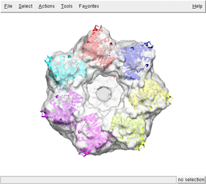
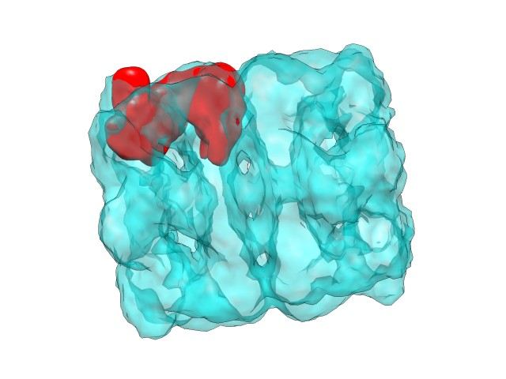
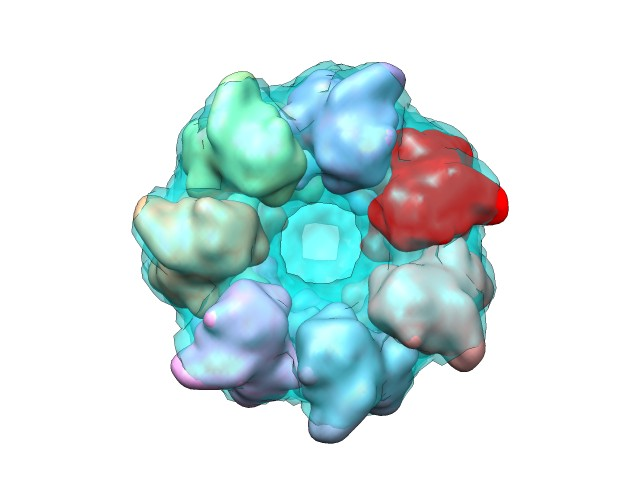

The ADP_EM Tutorials are practical guides for researchers who want to use ADP_EM to perform multiresolution docking. They include working examples and simple instructions. Before you go through the tutorial, first get the corresponding files from download zone. The following tutorials are currently available: single fitting, multiple fitting, benchmark fitting. 

## Single fitting

As the first exercise let’s dock the GroEl subunit into the whole GroEL-GroES map. The GroEL-ATP from E.coli was taken from <a href="http://www.ebi.ac.uk/msd-srv/emsearch/index.html">The Macromolecule Structure Database </a>(EMD). The map with EMD ID 1047 emd1047.ccp4 was downloaded from EMD (It was also pre-processed to remove discontinuous density using voledit tool of SITUS package, floodfill at 0.060). The docking exercise will consist in the localization of a GroEL subunit (chainA.pdb extracted from 2C7E pdb) and their related symmetric copies. First download, uncompress and untar the corresponding single tutorial file. This file contains all the necessary files to perform the tutorial. I recommend create a new working directory, so all the output files will be stored on it.  To perform the docking just prompt:

../bin/adp_em ../emd1047.ccp4 ../chainA.pdb 16 0.060 14.9 -n 18

where 16 corresponds to the harmonic bandwidth used, 14.9 is the resolution in angstroms, 0.06 the density cutoff used and 18 the number of fits saved. Here is the screen output:

<pre>adp_em&gt; adp_em&gt;           ADP_EM adp_em&gt; adp_em&gt;           Single PDB adp_em&gt;           Laplacian Kernel Filtering adp_em&gt;           Search Mode: Mask adp_em&gt;           Save 20 best fits adp_em&gt;           Sampling-&gt; Rot: 11.250 (bw=16)  Trans: 3.725 adp_em&gt; adp_em&gt; adp_em&gt; Step 1: Processing EM-map &amp; pdb... adp_em&gt; adp_em&gt;    3DMAP  ../emd1047.ccp4 adp_em&gt;           Resolution 14.900000 cutoff 0.060000 adp_em&gt;           Initial dimensions 128x128x128 adp_em&gt;           Grid Size 1.862x1.862x1.862 adp_em&gt;           Mass center 40.999x41.001x44.586 adp_em&gt;           Radii E  8 54 I  6 40 Z  0  0 adp_em&gt;           Radii E 11 55 I  0  0 Z 12 56 adp_em&gt;           Final dimensions 85x85x89  voxels adp_em&gt; adp_em&gt;    PDB    ../chainH.pdb adp_em&gt;           DIM: Low pass 50x49x58 adp_em&gt;           Radii E  9 31 I  0  0 Z 10 32 adp_em&gt;           Final dimensions 52x51x60  adp_em&gt; adp_em&gt; Step 2: Search... adp_em&gt; adp_em&gt;           Trans limits min 0.000 max: 46.000 init 0.000 adp_em&gt;           Explored 16737 (mask 134001 not 66468): time 244.02 sec adp_em&gt;           Max peaks 100 (allowed 100) adp_em&gt;           Peaks found 18 (from 100 peaks) time: 251.29 sec adp_em&gt; adp_em&gt;       Total searching time  252.30 sec adp_em&gt; adp_em&gt; adp_em&gt; Step 3: Saving Solutions... adp_em&gt; adp_em&gt; ------------------------------------------------------------------------- adp_em&gt;        Psi         Theta        Phi           X      Y      Z    Corr adp_em&gt; ------------------------------------------------------------------------- adp_em&gt;  1  315.80   -0.00  304.65   52.00  18.00  64.00   0.248 adp_em&gt;  2  341.06   -0.00  228.44   30.00  20.00  64.00   0.248 adp_em&gt;  3  344.72   -0.00   63.03   44.00  68.00  64.00   0.239 adp_em&gt;  4  352.64   -0.00  116.45   22.00  60.00  64.00   0.238 adp_em&gt;  5  313.56   -0.00  201.01   16.00  38.00  64.00   0.236 adp_em&gt;  6  241.29   -0.00   72.41   66.00  36.00  64.00   0.235 adp_em&gt;  7  353.09   -0.00   15.62   64.00  58.00  64.00   0.235 adp_em&gt;  8  316.95  180.00  301.91   58.00  22.00  24.00   0.223 adp_em&gt;  9  315.23  180.00   44.85   58.00  62.00  24.00   0.221 adp_em&gt; 10   27.06  180.00  164.44   35.86  66.75  24.04   0.221 adp_em&gt; 11  243.06  180.00  285.23   68.00  42.00  24.00   0.221 adp_em&gt; 12  358.67  180.00  192.71   18.55  53.01  23.97   0.220 adp_em&gt; 13  290.07  172.32  227.73   36.00  18.00  24.00   0.218 adp_em&gt; 14  296.26  172.33  176.39   18.00  32.00  24.00   0.216 adp_em&gt; 15   82.25    6.49  284.40   60.00  58.00  64.00   0.182 adp_em&gt; 16   81.49    5.67   25.02   22.00  56.00  64.00   0.180 adp_em&gt; 17   83.58    5.67  330.74   40.00  66.00  64.00   0.178 adp_em&gt; 18   45.56  173.93  336.97   36.00  14.00  24.00   0.170 adp_em&gt; -------------------------------------------------------------------------- adp_em&gt; adp_em&gt;         Saved in adpEM[1-18].pdb files adp_em&gt;         Total Time  255.63 sec adp_em&gt; adp_em&gt;</pre>

For visualizing the results use your favorite program. Here we display superimposed the 7th first best fittings (files from adpEM0001.pdb to adpEM0007.pdb) with the GroEL-GroES map using chimera

<table cellpadding="0" align="center">
<tbody>
<tr>
<td></td>
<td></td>
</tr>
</tbody>
</table>
As you can see, the heptameric ring has been properly reconstructed.

## Multiple fitting

If you are interested in fitting multiple atomic structures into a single EM density map this is your tutorial. As an example we are going to dock a native structure (used to generate the target density maps), 300 homology models, an a template structure (remote homolog used to generate the models) into a simulated EM map. The homology models and the maps has been downloaded from http://salilab.org/modem/modem_benchmark.tar.gz. Since ADP_em does not support MRC format, the maps have been converted to Situs format (ccp4 can be used as well). The tutorial file includes all the models and the EM maps only for 1DXT case (the original Sali's benchmark included another 7 test cases that can be processed equivalently). Please follow the step-by-step instructions of how to perform this multiple docking case.

1) Create column PDB list. As a required input the user must provide a one-column ASCII file with the file names of the pdbs to be docked. In our case, all the models are stored in a single directory named 1dxt. To generate such list you can take advantage of the "find" Unix tool. As in the previous tutorial, create a new directory to work on it. 

find ../1dxt -name "*.pdb" -print0 | xargs -0 ls -1 &gt; listpdb

With previous command we have all the pdb names stored on the file "listpdb" in a single column format .

2) To run the program:

../bin/adp_em ../1dxt-10A.sit listpdb 16 0.0 10 -f 0 -m

where -m is mandatory flag for multiple docking (otherwise listpdb will be interpreted as a single input file, and the program will crash), 16 is the bandwidth, 10 the resolution of the map, and 0.0 the density cut-off. Since the atomic models accounts for all the density of the map the fitting criteria is set to simple density cross-correlation (-f 0 option). Here is the corresponding output:

<pre>adp_em&gt; adp_em&gt;           ADP_EM adp_em&gt; adp_em&gt;           Multiple PDBs (302 files)  adp_em&gt;           No Filtering adp_em&gt;           Search Mode: Mask adp_em&gt;           Save 50 best fits adp_em&gt;           Sampling-&gt; Rot: 11.250 (bw=16)  Trans: 2.000 adp_em&gt; adp_em&gt; adp_em&gt; Step 1: Processing EM-map &amp; pdb... adp_em&gt; adp_em&gt;    3DMAP  ../1dxt-10A.sit adp_em&gt;           Resolution 10.000000 cutoff 0.000000 adp_em&gt;           Initial dimensions 64x64x64 adp_em&gt;           Grid Size 1.000x1.000x1.000 adp_em&gt;           Mass center 31.000x32.000x33.000 adp_em&gt;           Radii E 21 38 I  0  0 Z 22 39 adp_em&gt;           Radii E 21 38 I  0  0 Z 22 39 adp_em&gt;           Final dimensions 62x65x65  voxels adp_em&gt; adp_em&gt; Step 2: Exaustive search... adp_em&gt; adp_em&gt; adp_em&gt;    PDB    ../1dxt/1dxt.pdb 1/302 adp_em&gt;           DIM: Low pass 56x61x60 adp_em&gt;           Radii E 17 35 I  0  0 Z 18 36 adp_em&gt;           Final dimensions 56x61x60  adp_em&gt;           Trans limits min 0.000 max: 21.000 init 0.000 adp_em&gt;           Explored 439 (mask 3471 not 33320): time 4.34 sec adp_em&gt;           Max peaks 100 (allowed 100) adp_em&gt;           Peaks found 12 (stored 12 (max 100) time: 10.35 sec adp_em&gt; adp_em&gt;    PDB    ../1dxt/1hbg.pdb 2/302 adp_em&gt;           DIM: Low pass 59x61x50 adp_em&gt;           Radii E 16 31 I  0  0 Z 17 32 adp_em&gt;           Final dimensions 59x61x50  adp_em&gt;           Trans limits min 0.000 max: 22.000 init 0.000 adp_em&gt;           Explored 639 (mask 5117 not 33120): time 5.79 sec adp_em&gt;           Max peaks 100 (allowed 100) adp_em&gt;           Peaks found 15 (stored 27 (max 100) time: 11.18 sec ...  adp_em&gt;      Total searching time  3920.000000 sec adp_em&gt; adp_em&gt; adp_em&gt; Step 3: Saving Solutions... adp_em&gt; adp_em&gt; ------------------------------------------------------------------------- adp_em&gt;        Psi         Theta        Phi           X      Y      Z    Corr adp_em&gt; ------------------------------------------------------------------------- adp_em&gt;  1  259.12   -0.00  101.62   30  32  34   0.986  ../1dxt/1dxt.pdb adp_em&gt;  2  150.41  141.53  121.65  32  32  32   0.962  ../1dxt/model34.pdb adp_em&gt;  3  144.19  132.59  114.67  32  32  32   0.960  ../1dxt/model54.pdb adp_em&gt;  4  142.22  154.84  127.22  30  32  34   0.958  ../1dxt/model195.pdb adp_em&gt;  5  171.19  146.19  142.90  32  32  32   0.955  ../1dxt/model94.pdb adp_em&gt;  6  174.37  131.21  129.78  32  32  32   0.953  ../1dxt/model51.pdb adp_em&gt;  7  157.61  141.37  126.43  32  32  32   0.952  ../1dxt/model60.pdb adp_em&gt;  8  146.24  136.78  112.96  32  32  32   0.952  ../1dxt/model35.pdb adp_em&gt;  9  167.50  138.04  134.76  32  32  32   0.952  ../1dxt/model97.pdb adp_em&gt; 10 151.20  144.26  118.80  32  32  32   0.951  ../1dxt/model18.pdb
..... adp_em&gt; 49  173.69  148.52  142.39  32  32  32  0.941  ../1dxt/model71.pdb adp_em&gt; 50  173.13  127.89  135.25  30  32  34  0.941  ../1dxt/model81.pdb adp_em&gt; -------------------------------------------------------------------------- adp_em&gt; adp_em&gt;         Saved in adpEM[1-50].pdb files adp_em&gt;         Total Time  3921.000000 sec adp_em&gt; adp_em&gt;  </pre>

4) Inspect the results adpEM[1-50].pdb with your favorite viewer. You can for example compare the obtained docking poses of the native (1dxt.pdb) and the best fitting model (model34.pdb), which correspond to the first (adpEM0001.pdb) and second best fit (adpEM0002.pdb), respectively.

<table cellspacing="2" cellpadding="0" align="center">
<tbody>
<tr>
<td></td>
</tr>
</tbody>
</table>

 

Note the high similarity of the best fitting model with the original structure used for generate the map.

3) At adp_em_multi.log file you can find the 10 best fits of each model. If you want to build a table with the best fit of each homology model, just run the following commands:

grep "1" adp_em_multi.log &gt; temp  sort -r -k 11 temp &gt; results10

<pre>&gt;more results10 1  259.12   -0.00    101.62   30.00  32.00  34.00 0.986  ../1dxt/1dxt.pdb 1  150.41  141.53  121.65   32.00  32.00  32.00 0.962  ../1dxt/model34.pdb 1  144.19  132.59  114.67   32.00  32.00  32.00 0.960  ../1dxt/model54.pdb 1  142.22  154.84  127.22   30.00  32.00  34.00 0.958  ../1dxt/model195.pdb 1  171.19  146.19  142.90   32.00  32.00  32.00 0.955  ../1dxt/model94.pdb 1  174.37  131.21  129.78   32.00  32.00  32.00 0.953  ../1dxt/model51.pdb 1  167.50  138.04  134.76   32.00  32.00  32.00 0.952  ../1dxt/model97.pdb 1  157.61  141.37  126.43   32.00  32.00  32.00 0.952  ../1dxt/model60.pdb 1  146.24  136.78  112.96   32.00  32.00  32.00  0.952  ../1dxt/model35.pdb 1  148.56  146.92  122.55   32.00  32.00  32.00  0.951  ../1dxt/model19.pdbç  </pre>

## The fitting benchmark

To test our methodology we build a benchmark formed by 28 simulated docking cases, comprising a wide variety of macromolecular shapes. Each test case consists of a macromolecule atomic structure, five simulated density maps generated from it (at experimental resolutions of 10, 15, 20, 25 and 30Å), and different atomic structures which correspond to subunit components of the target macromolecule. Each docking test consist of localizing the atomic structural subunits into the corresponding complete simulated 3D-EM map. For future developments and comparations the docking benchmark has been made available. Here is the complete list:

<table class="text" border="0" cellspacing="0" cellpadding="6" align="center" bgcolor="#f0f0f0">
<tbody>
<tr>
<td>
<ol>
<li><b>1aw5</b> 5-aminolaevulinate dehydratase (8x subunits);</li>
<li><b>1e6v_a</b> chain A of methyl-coenzyme M reductases (2x);</li>
<li><b>1e6v_b</b> chain B of methyl-coenzyme M reductases (2x);</li>
<li><b>1e6v_bc</b> chain BC of methyl-coenzyme M reductases (2x);</li>
<li><b>1fpy</b> glutamine synthetase (10x);</li>
<li><b>1g8g</b> ATP sulfurylase (6x)</li>
<li><b>1gd1</b> holo-glyceraldehyde-3-phosphate dehydrogenase (4x)</li>
<li><b>1j2p</b> proteasome a-ring(7x);</li>
<li><b>1k32</b> tricorn protease as homohexamer (6x);</li>
<li><b>1kf6_a</b> chain A of quinol-fumarate reductase (2x);</li>
<li><b>1kf6_cd</b> chain CD of quinol-fumarate reductase (2x);</li>
<li><b>1l1f </b>glutamate dehydrogenase (6x);</li>
<li><b>1n6d</b> tricorn protease as homotrimer (3x);</li>
<li><b>1nic</b> Cu-nitrite reductase (3x);</li>
<li><b>1q5b</b> cadherin (3x);</li>
<li><b>1ruz_j</b> hemagglutinin (3x) RecA (6x);</li>
<li><b>1w3a</b> lectin (6x);</li>
<li><b>1xmv</b> RecA (6x);</li>
<li><b>2a79_a</b> chain A of voltage-gated potassium channel ß2-subunit (4x);</li>
<li><b>2pil</b> pilin (5x);</li>
<li><b>7cat</b> catalase (7cat,4x);</li>
<li><b>groel_a</b> chain A GROEL (7x) into 1aon map</li>
<li><b>groel_h</b> chain H GROEL (7x) into 1aon map</li>
<li><b>groes</b> chain O GROES (7x) into 1aon map</li>
<li><b>ribE</b> ribosomal protein S2(1x) into 1gix-1giy map</li>
<li><b>ribX</b> 30S subunit of ribosome (1gix,1x) into 1gix-1giy map</li>
<li><b>ribY</b> 50S subunit of ribosome (1giy,1x) into 1gix-1giy map</li>
<li><b>ther</b> thermosome (1QV2, 14x);</li>
</ol>
</td>
</tr>
</tbody>
</table>

In each directory (bold face in the list) you can find all the maps in situs format (.sit extension) and the subunits to be docked in PDB format. Since typically are multiple copies of the subunits in the macromolecule map, for comparison purposes, each of them are available in separate pdb files (m1, m2, m3..etc). For example, for running one test using our approach, just use:

adp_em 1aw5/1aw5_15.sit 1aw5/1aw5m1.pdb 16 15 0.0

Since it is a 8-mer, you can find 8 best fits which poses correspond to the original ones (pdb files 1aw5m(1-8) ).

## How to fit two volumes

ADP_EM not only provides a way to fit atomic structures inside a low-resolution map. It allows also the rigid-body fitting of two tridimensional maps. This feature provides a way to compare different experimental maps of the same molecule or to localize the low-resolution information of a molecule inside the low map of a macromolecular complex.

The process of fitting a 3D map into another map is quite similar to atomic structure fitting. The only aspects that must be changed in the invocation of the command are:

<ol>
<ol>
<li>Instead of a PDB file, the second argument must be a CCP4/SIT format file containing the map to be fitted.</li>
</ol>
</ol>
 
<ol>
<li>The fifth argument, instead of defining the resolution, will set the density cutoff for the map to be fitted. Notice that in this case the resolution value makes no sense since we do not have a pdb to be filtered.  </li>
</ol>

<strong>Example:</strong>

In this case we have simulated a 14.9  resolution map (right) from a single chain of 60 KDA CHAPERONIN (2C7E.pdb):

<table style="width: 122px;" border="0" cellspacing="2" cellpadding="0" align="center">
<tbody>
<tr>
<td></td>
<td></td>
</tr>
</tbody>
</table>

This map will be fitted in the experimental map emd1047.ccp4 (download from EMD, removed discontinuous density using voledit tool of SITUS package. Resolution 14.9 and floodfill at 0.060):

<table style="width: 122px;" border="0" cellspacing="2" cellpadding="0" align="center">
<tbody>
<tr>
<td></td>
</tr>
</tbody>
</table>

To fit the chain map, adp_em must be invoked in the next way:

adp_em emd1047.ccp4  chainH_14.9.sit  16 0.060 0.060  -n 20

This will return:

<pre>adp_em&gt; adp_em&gt;           ADP_EM adp_em&gt; adp_em&gt;           EM map adp_em&gt;           Laplacian FT Filtering adp_em&gt;           Search Mode: Mask adp_em&gt;           Save 100 best fits adp_em&gt;           Sampling-&gt; Rot: 11.250 (bw=16)  Trans: 2.000 adp_em&gt; adp_em&gt; adp_em&gt; Step 1: Processing EM-map &amp; EM-map... adp_em&gt; adp_em&gt;    3DMAP  ../emd1047.ccp4 adp_em&gt;           Resolution 16.000000 cutoff 0.060000 adp_em&gt;           Initial dimensions 237x237x237 adp_em&gt;           Grid Size 1.000x1.000x1.000 adp_em&gt;           Mass center 74.201x74.203x82.158 adp_em&gt;           Radii E 15 99 I 10 76 Z  0  0 adp_em&gt;           Radii E 18 102 I  7 32 Z  0  0 adp_em&gt;           Final dimensions 152x153x161  voxels adp_em&gt; adp_em&gt;    3DMAP    chainH_14.9.sit adp_em&gt;           DIM: Low pass 72x68x86 adp_em&gt;           Radii E  5 47 I  0  0 Z  6 48 adp_em&gt;           Final dimensions 74x70x88  adp_em&gt; adp_em&gt; Step 2: Search... adp_em&gt; adp_em&gt;           Trans limits min 7.000 max: 97.000 init 7.000 adp_em&gt;           Explored 188156 (mask 1505750 not 285856): time -772.12 sec adp_em&gt;           Max peaks 100 (allowed 100) adp_em&gt;           Peaks found 13 (from 100 peaks) time: -745.41 sec adp_em&gt;  adp_em&gt;      Total searching time  3571.000000 sec adp_em&gt; adp_em&gt; adp_em&gt; Step 3: Saving Solutions... adp_em&gt; adp_em&gt; --------------------------------------------------------------------- adp_em&gt;        Psi         Theta        Phi           X      Y      Z    Corr adp_em&gt; --------------------------------------------------------------------- adp_vol_em&gt;  1  231.56   -0.00   74.24  122.00  62.00 116.00    0.280 adp_vol_em&gt;  2  318.03   -0.00   47.98  114.00 104.00 118.00    0.278 adp_vol_em&gt;  3  271.15   -0.00  248.68   28.00  66.00 118.00    0.277 adp_vol_em&gt;  4  236.86   -0.00   23.14   94.00  30.00 116.00    0.276 adp_vol_em&gt;  5  301.21   -0.00  109.98   78.00 124.00 116.00    0.273 adp_vol_em&gt;  6  226.15   -0.00  237.29   40.00 106.00 116.00    0.270 adp_vol_em&gt;  7  345.04   -0.00  221.22   52.00  32.00 118.00    0.266 adp_vol_em&gt;  8  285.06  173.71  266.11  104.00  38.00  42.00    0.252 adp_vol_em&gt;  9  318.54  174.10  198.85   32.00  54.00  44.00    0.247 adp_vol_em&gt; 10  320.77  174.30  106.70   64.00 122.00  44.00    0.245 adp_vol_em&gt; 11  314.32  180.00  146.96   32.00  96.00  42.00    0.244 adp_vol_em&gt; 12  312.89  173.18  249.85   64.00  28.00  44.00    0.242 adp_vol_em&gt; 13  309.71  171.51  353.51  122.00  74.00  44.00    0.238 adp_em&gt; ---------------------------------------------------------------------- adp_em&gt; adp_em&gt;         Saved in adpEM[1-13].sit files adp_em&gt;         Total Time  3617.000000 sec adp_em&gt; adp_em&gt;</pre>

Here, in a similar fashion to the atomic structure fitting case, the best rotations and translations showed in the log are applied to have the corresponding map solution files. Here can be observed the first solution from different points of view:

 
<table style="width: 122px;" border="0" cellspacing="2" cellpadding="0" align="center">
<tbody>
<tr>
<td></td>
<td></td>
</tr>
</tbody>
</table>

And here the reconstruction of one of the rings from the combination of the first solutions returned:

 
<table style="width: 122px;" border="0" cellspacing="2" cellpadding="0" align="center">
<tbody>
<tr>
<td></td>
</tr>
</tbody>
</table>

## How to perform a multiple comparative fitting 

To fit successive multiple atomic structures in a single low-resolution map, note that every model is fitted independently:

adp_em 1dxt-10A.sit listpdb.txt 16 0.0 10 -f 0 -m

The second argument (after the input map) must be a text file containing the paths and names of the PDB files with all the atomic structures to fit. There must contain a PDB name per line as: 
<pre>../1dxt/1dxt.pdb ../1dxt/1hbg.pdb ../1dxt/model100.pdb ../1dxt/model101.pdb ../1dxt/model102.pdb ../1dxt/model103.pdb</pre>

ADPEM will return a list of results where the last column shows the corresponding fitted PDB:  
<pre>1  259.12   -0.00   101.62    30.00  32.00  34.00    0.986  ../1dxt/1dxt.pdb 1  229.33  148.66  219.85   30.00  30.00  32.00    0.938  ../1dxt/1hbg.pdb 1  184.21  161.12  164.73   32.00  32.00  32.00    0.929  ../1dxt/model100.pdb 1  149.93  159.74  141.41   30.00  32.00  34.00    0.901  ../1dxt/model101.pdb 1  132.01  136.90  104.85   32.00  32.00  32.00    0.945  ../1dxt/model102.pdb 1  251.51  156.19  231.27   30.00  32.00  34.00    0.905  ../1dxt/model103.pdb 1  153.28  146.61  140.50   32.00  32.00  32.00    0.947  ../1dxt/model104.pdb
</pre>

